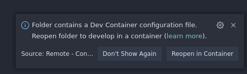
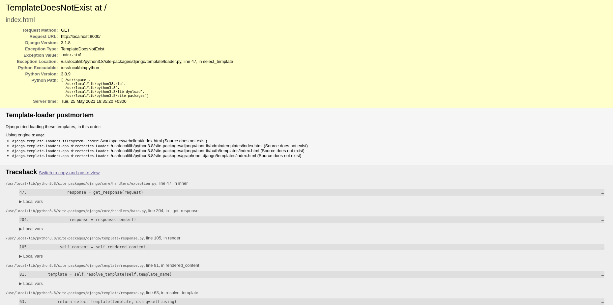

# Full Stack Starter Pack

## Licence
[](https://opensource.org/licenses/MIT)

## Description
Modern monolith web app template.
Template designed for docker and vscode (remote-containers).

## Stack

Name | Pic
-----|-----
Django | 
PostgreSQL | 
Graphene Python | 
GraphQL | 
React | 
Relay | 
React Styled-Components | 
Docker | 
Nginx | 

## Using this template

First, you need to install [vscode](https://code.visualstudio.com/) extension - [Remote Containers](https://code.visualstudio.com/docs/remote/containers).

### Common

To generate configs:
```bash
./helper.sh config
```

#### Environment variables
Name | Description
---- | ----
`SECRET_KEY` | Django secret key. For generate new once, you can use service https://djecrety.ir/
`DEBUG` | Flag to tell django work on debug mode or not.
`DB_NAME` | PostgreSQL db name.
`DB_USER` | PostgreSQL db user.
`DB_PASSWORD` | PostgeSQL db password.
`REACT_APP_BACKEND_URL` | Endpoint for backend (In file `client/.env`)

Also, look at `.env.example` in `kernel` and `client`.

To copy schema.json from kernel to client (Use `-d` flag to generate it from kernel):
```bash
./helper.sh gql
```

Build react app
```bash
./helper.sh build
```

----

### Backend

For developing backend with django, open django project in vscode and reopen it in container.

```bash
code kernel
```



For migrate:
```bash
./manage.sh migrate
```

For create new django app:
```bash
./manage.sh app
```

It will create new django app with this structure:
```bash
app/
├── admin
│   └── __init__.py
├── apps.py
├── __init__.py
├── models
│   └── __init__.py
├── schema
│   ├── __init__.py
│   └── schema.py
└── services
    └── __init__.py
```

Dump graphql schema:
```bash
./manage.sh gql
```

To run server:
```bash
./manage.sh run
```

Create superuser:
```bash
./manage.sh su
```

To debug django code use `cmd+F5`

Open http://localhost:8000 you will see this and this is normall. There is no builded webclient.



Open http://localhost:8000/admin to see admin dashboard.
Open http://localhost:8000/api to see graphql api sandbox.

---

### Frontend

For developing frontend react app, open react project and reopen it in container.

```bash
code client
```


Install all libs:
```bash
yarn
```

Run relay compiler:
```bash
yarn relay
```

Run develop server:
```bash
yarn run
```


### Deploy
To run deploy script:
```bash
./deploy.sh
```

On local machine app will running on http://0.0.0.0/
